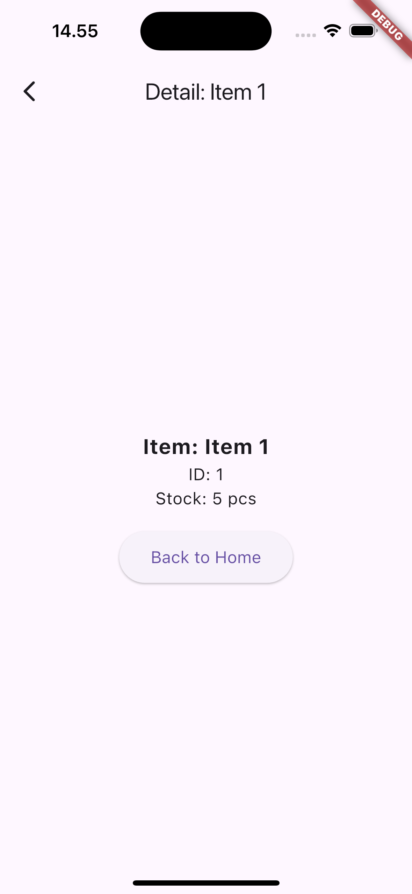
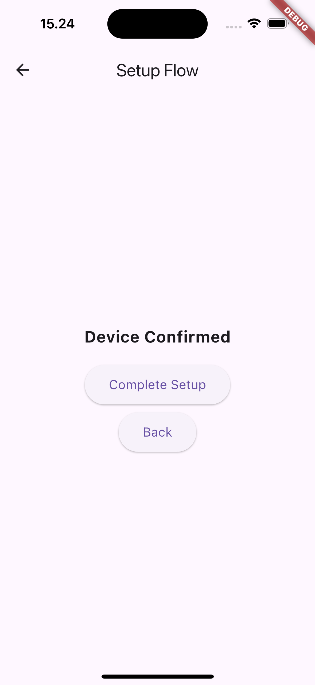

# Navigation on Flutter

Muhamad Farhan - 4522210057

## Tujuan Praktikum

Untuk Memahami konsep dasar navigasi dan mengimplementasikannya pada Flutter agar terlihat lebih menarik dan adaptive.

## Named Routes
### Penjelasan Singkat
Ini adalah navigasi paling dasar dan sering digunakan di Flutter untuk penggunaan yang sederhana.

### Widget Yang Digunakan
Widget yang digunakan pada program ini antara lain HomeScreen, DetailScreen, SettingsScreen, dan AboutScreen yang berinteraksi dengan Navigator untuk mengelola halaman aplikasi melalui metode push atau pop.

### Screenshots


## Navigation 2.0
### Penjelasan Singkat
Ini adalah sistem navigasi yang lebih baru dan lebih kuat di Flutter untuk mengatasi keterbatasan pada Named Routes.

### Widget Yang Digunakan
Widget yang digunakan pada program ini antara lain HomeScreen dan DetailScreen yang berinteraksi dengan Navigator untuk mengelola halaman aplikasi dengan mendefinisikan secara deklaratif, tidak melalui metode push ataupun pop.

### Screenshots



## Nested Navigation
### Penjelasan Singkat
Ini adalah sistem navigasi yang terjadi di dalam bagian tertentu dari UI, bukan dari seluruh aplikasi dimana setiap tab atau bagian memiliki tumpukan navigasinya sendiri yang independent.

### Widget Yang Digunakan
Widget yang digunakan pada program ini antara lain HomeScreen, SetupFlowScreen, FindDevicesScreen, ConnectDeviceScreen, dan ConfirmDevice yang di dorong ke navigator utama.

### Screenshots



## Deep Link Navigation
### Penjelasan Singkat
Ini adalah sistem navigasi yang membuka konten spesifik di dalam aplikasi melalui URL yang memungkinakan pengguna untuk langsung menuju ke layar tertentu di aplikasi.

### Widget Yang Digunakan
Widget yang digunakan pada program ini antara lain AppRouterDelegetae (otak dari navigasi), AppRouteInformationParser (translator antara URL dan RoutePath), beserta HomeScreen, DetailScreen, dan SettingsScreen yang berinteraksi dengan AppRouteDelegate.

### Screenshots


## Cara menjalankan aplikasi di Android Studio
Pastikan kamu sudah menginstall dependensi terlebih dahulu:

```bash
flutter pub get
```

Jalankan aplikasi:

```bash
flutter run
```
